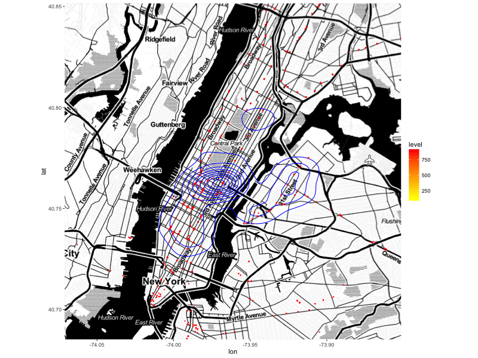

# New York City on the Move: 
##    Stories about New Yorkers' Go-Abouts with Yellow Cab Data 

## Qianqi Kay Shen
## October 28, 2016

## 1. Summary

This project analyses over 500 million New York City cab trip records, combined with the OpenStreetMap data, to tell a story about New Yorkers' move-abouts and daily lives. As of March 2014, 51,398 men and women licensed to drive medallion taxicabs (a.k.a, yellow cabs) in New York City. Every day, 600,000 people take a cab, accounting to 236 million in a year (reference: New York City Taxi and Limousine Commission). The yellow cabs provide a most convenient option for New Yorkers (and visitors) to go around the city. I ask a series of questions to find out interesting facts about the pattern of New Yorkers' cab usage. 

## 2. Questions and Deliverables

The main question that is driving this project is: How do New Yorkers use yellow cabs? I wonder: Who are they? When and where do they hail a cab? Where do they go? For example, do people take a cab to work? Where do they dine out on weekday nights and Friday nights? Do they go different places after work on weekdays and on weekends? Where do the opera-goers go after the show? Who tip the most, bigger group of young people going around the city or people who live in one of the wealthiest neighborhoods? 

The deliverables include a report of data analysis, charts and figures to describe cab usage, and maps to show patterns of movements and activities at destinations. 

A. **Passengers' cab usage descriptions and analyses** include but not limited to: the numbers of trips by weekdays, by months, and by hours each day; numbers of trips on special holidays; average miles, fares, tips by different time and destinations; top destinations and pickup locations by weekdays, by months, and by hours each day; the number of pickups and dropoffs of people at certain places (cab usage by kinds of places), such as schools, restaurants, churches, stores, neighborhoods, and so on; cab usage by different types of the same kind of place--for example, whether people go to fine dining restaurants more likely to take cabs than people go to fast food chains; 

B. **Mapping of movements and activities** include but not limited to: heat maps of cab pickups and dropoffs by weekdays, by months, by hours, by special holidays; heat maps overlaying with different kinds of locations; plots of pickup and dropoff locations by different times of the day and days of the week; trip plots from and to certain locations; plots of destinations by distances of trips; plots of trips from and to public transit stations. 

## 3. Data
I use the yellow taxi trip record data from New York City Taxi and Limousine Commission (http://www.nyc.gov/html/tlc/html/about/trip_record_data.shtml) for trip data. This data contains information including trip pick-up and drip-off time and location coordinates, trip distances, fares, tips, and so on. 

In addition, for coordinate location information, I use OpenStreetMap New York City XML OSM data (http://metro.teczno.com/#new-york). After cleaning up the data, I constructed a  dataset contains main description information about each locality nodes (represented by a longitude-latitude pair), including what business it is in (be it school, theatre, restaurants, and so on) and the name of the locality.

For the preliminary stage, I use a sample of both datasets for quick analysis. For yellow taxi trips, the sample contains all trip information from 2016-01-24 to 2016-01-30. For OSM data, I focus on theatre data. 

## 4. Potential problems with the data
I realize that the majority of New Yorkers may use public transit such as subways and bus instead of cabs for daily commute. Even for the people who use hailing service, yellow cabs do not tell the entire story. There are For-Hire vehicles and UBER cabs. Nevertheless, as of August 2016, yellow cab daily trip number still almost doubles UBER (source: http://toddwschneider.com/posts/taxi-uber-lyft-usage-new-york-city/). The yellow cab data will tell a rather interesting and different story from public transit data about the commute pattern of New Yorkers.

## 5. Priliminary Analysis:
### 5.1. Data descriptions

There are 2,323,898 trip records in the data sample, which cover all trips from 2016-01-24 to 2016-01-30. Counting trips by weekdays, we find out that the trip numbers increase sequentially from Sunday to Saturday. Sunday has the least trip number, which is 157,344, and Saturday has the largest trip number, 427,577.


Looking the data by hours, we find out that there are two peak hours. Unsurprisingly, they 
overlap with commute hours, 8 in the morning and 19 in the evening. Interestingly, more people take a cab to go home than go to work.


I also plotted the trip number by hours by weekdays. It turns out that New Yorkers do take cabs to work. As the week goes by, more and more commuters choose to go to work and go home by cab. Friday night is the go out night. Cabs go around town until early morning Saturday. And the fun continues throughout Saturday. However, the city quiets down from Sunday early morning--significantly fewer people go out on cabs throughout Sunday. 


This plot uses all the trips as inputs, and it basically becomes a road map of New York City area! As seen from the map, most cab use concentrates in Manhattan, and then the downtown areas in Queens and Brooklyn. Very little cab use in Bronx. In addition, we notice there is a cab line along a subway line (probably E) connecting to JFK Airport. It's very likely that people coming from and going to airport combine their trips with taxi and subways! 


Let's see where the cab-taking working New Yorkers are coming from and going to work. Manhattan is still the place where more cab use is in. However, pickups are more concentrating on the east side, while dropoffs are all over Manhattan. In addition, dropoffs are more sparse, especially in Queens and Brooklyn areas. 


Below are queries that show the neighborhoods as pick-up or drop-off locations that are with the highest numbers of trips. Midtown, Upper East, Upper West, Gramercy, which are high social-economic well-off neighborhoods, dominate most of the trips. 

Top 10 Pickup Neighborhoods among all Trips
```
          pickup_name             pickup_city    percent
1             Midtown New York City-Manhattan 16.3299766
2     Upper East Side New York City-Manhattan 14.4549374
3     Upper West Side New York City-Manhattan  8.4492521
4            Gramercy New York City-Manhattan  8.1845675
5             Chelsea New York City-Manhattan  6.6175452
6    Garment District New York City-Manhattan  5.5317832
7   Greenwich Village New York City-Manhattan  4.5621624
8        East Village New York City-Manhattan  3.3785046
9        Murray Hill New York City-Manhattan  3.3705868
10            Clinton New York City-Manhattan  2.8678539
```
Top 10 Dropoff Neighborhoods among all Trips
```
         dropoff_name            dropoff_city   percent
1             Midtown New York City-Manhattan 14.941878
2     Upper East Side New York City-Manhattan 13.626975
3     Upper West Side New York City-Manhattan  8.544523
4            Gramercy New York City-Manhattan  7.473047
5             Chelsea New York City-Manhattan  5.998585
6    Garment District New York City-Manhattan  4.496970
7   Greenwich Village New York City-Manhattan  3.842337
8         Murray Hill New York City-Manhattan  3.307589
9       East Village New York City-Manhattan  3.230951
10            Clinton New York City-Manhattan  3.050306
```
Top 10 Pickup Neighborhoods among all Trips during Weekday Morning (5am-9am)
```
          pickup_name             pickup_city   percent
1     Upper East Side New York City-Manhattan 2.5379341
2             Midtown New York City-Manhattan 1.8704780
3            Gramercy New York City-Manhattan 1.1801292
4     Upper West Side New York City-Manhattan 1.1599046
5    Garment District New York City-Manhattan 0.9939765
6             Chelsea New York City-Manhattan 0.821163
7         Murray Hill New York City-Manhattan 0.5517884
8   Greenwich Village New York City-Manhattan 0.4976552
9            Clinton New York City-Manhattan 0.4821210
10       East Village New York City-Manhattan 0.3057363
```
Top 10 Dropoff Neighborhoods among all Trips during Weekday Morning (5am-9am)
```
          dropoff_name            dropoff_city   percent
1              Midtown New York City-Manhattan 3.6419843
2      Upper East Side New York City-Manhattan 1.7191374
3             Gramercy New York City-Manhattan 1.1122691
4              Chelsea New York City-Manhattan 0.8539101
5     Garment District New York City-Manhattan 0.7309701
6      Upper West Side New York City-Manhattan 0.7307550
7          Murray Hill New York City-Manhattan 0.6013173
8   Financial District New York City-Manhattan 0.4728263
9   Greenwich Village New York City-Manhattan 0.3678303
10             Clinton New York City-Manhattan 0.3177420
```
Do people take cab to subway stations? Yes, they do. And you probably would expect that more people that live *outside* Manhattan do so. However, the numbers show that most people who do so lives *in* Manhattan. Or another way to put this could be that people from these neighborhoods would rather take a taxi than take the subway. 


Top 10 Neighborhoods that Take Cab to Destinations near (half block from) Subway Entrances 
```
                pickup_name             pickup_city   num
1           Upper East Side New York City-Manhattan 18564
2                   Midtown New York City-Manhattan 18547
3           Upper West Side New York City-Manhattan  9085
4                  Gramercy New York City-Manhattan  8420
5                   Chelsea New York City-Manhattan  7238
6          Garment District New York City-Manhattan  6031
7         Greenwich Village New York City-Manhattan  4829
8               Murray Hill New York City-Manhattan  4297
9              East Village New York City-Manhattan  4115
10                  Clinton New York City-Manhattan  3182
```

And I map three neighborhoods (Upper East, Chelsea, and Astoria in Queens) that are with high numbers of such trips to show which subway entrances these people take cabs to. But keep in mind that some of them may just take cabs to the destinations that happen to be subway entrances. As shown by the map, it is more likely for people who live outside Manhattan to take a taxi trip to subway entrance to go to work. The comparison figure of all three neighborhoods show that it is general more likely for people living in Astoria to take a taxi to subway entrances in any given hours during the day.

### Taxi Trips from Upper East to Subway Entrances on Weekdays during Morning (7-9 am)


### Taxi Trips from Chelsea to Subway Entrances on Weekdays during Morning (7-9 am)


### Taxi Trips from Astoria, Queens to Subway Entrances on Weekdays during Morning (7-9 am)


Top 10 Neighborhoods that Take Cab from Destinations near (half block from) Subway Entrances 

```
               dropoff_name            dropoff_city   num
1                   Midtown New York City-Manhattan 25003
2           Upper East Side New York City-Manhattan 22242
3           Upper West Side New York City-Manhattan 15915
4                  Gramercy New York City-Manhattan 13397
5                   Chelsea New York City-Manhattan 10937
6          Garment District New York City-Manhattan  6933
7              East Village New York City-Manhattan  6253
8         Greenwich Village New York City-Manhattan  6220
9              Murray Hill New York City-Manhattan  5918
10                  Clinton New York City-Manhattan  5420
```

### Taxi Trips from Subway Entrances to Upper East on Weekdays during Evening (5-7 pm)


### Taxi Trips from Subway Entrances to Chelsea on Weekdays during Evening (5-7 pm)


### Taxi Trips from Subway Entrances to Astoria, Queens on Weekdays during Evening (5-7 pm)



Where do people go out on Friday night? To my surprise, the dropoff locations do not seem perfectly co-locate with the restaurants. This could be due to that the OSM data is incomplete. Or, people simply do not take cabs to restaurants. But anyway, this will need further investigations, including, but not limited to, analyzing data from other weeks. 


Then, would New Yorkers be taking cabs in late Friday night? Yes, more New Yorkers are taking cabs after 10 o'clock Friday night. 


Now, let's take a look at the theatre district on Friday night. The map shows where people go after leaving the theatre district on Friday night. Most trips are in Manhattan. Very few go to Queens. And even fewer to other areas. But the data points are too small at this point, so I will need more data to investigate this question. 


Who are the riders that pay the highest tip? In general, people take a cab within Manhattan tip higher. High tippers tend to be those who go to Times Square and Midtown. They could be visitors or financial bankers. Besides, wealthy people living in Upper East seem to tip more as well.


# 7. Conclusion
This exciting data exploratory project targets the audiences who are interested in urban life and traffic movements, such as government agencies, businesses interested in consumer behaviors, and anyone who are interested in New York City commutes.  Audience may also find useful information for business and commercial activities--for example, enterprises finding locations for their businesses may find this report informative. With the data of New York cab service, this project tells multiple interesting stories about New Yorkers' commute. Combining with OpenStreetMap data, a lot more interesting questions can be answered. We not only know about the time and locations of people's movement with cabs, but we will also know what kind of activities people engaged in at their destinations.The mapping of the trips and descriptions of the destinations will show a series of stories about the daily life of New Yorkers.
